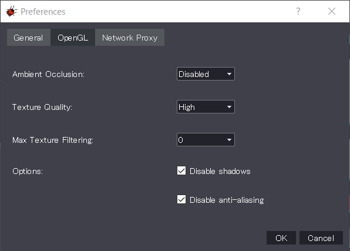

## Installation Guide
1. Install pip3 & required libraries
    1. Open the terminal window.
    2. Run the following command to install pip:  
    `sudo apt install python3-pip`
    3. Run the following command to install libraries:  
    `python3 -m pip install numpy termcolor requests`

1. Download & Install the Webots version **2022.a**
    1. Open the terminal window.
    2. Run the following command to download the installation package:  
      `wget https://github.com/cyberbotics/webots/releases/download/R2023a/webots_2023a_amd64.deb`
    3. Run the following command to install it:  
      `sudo apt install ./webots_2022a_amd64.deb`

1. Download and **unzip** the latest Erebus [Release Build](https://gitlab.com/rcj-rescue-tc/erebus/erebus/-/releases).

## Run the environment
Run the world1.wbt file from terminal. If the file located in `/home/USER_NAME/EREBUS_FOLDER/game/worlds/world1.wbt`  
, just run the following command:  
`webots '/home/USER_NAME/EREBUS_FOLDER/game/worlds/world1.wbt'`  

The first time you run the simulator, it will automatically install the Python libraries needed to run the simulation, which may take some time (Initializing Process).

If the time limit is not displayed, as in the following image, the initializing process is in progress. This process can take up to a minutes, depending on the performance of your computer.  

## Troubleshooting
### If your Webots screen comes up blank/black
Copy and the download, unzip to a separate folder before opening the world. It should then work.

### The simulation runs too slowly
This is probably due to the low performance of your computer. This may be improved by adjusting the "accuracy" of the graphics according to the following procedure. However, you should take into account that these "adjustments" are only valid for testing in your environment, and that in a competition the game may be run under different adjustments.
1. Open Tools -> Preferences in the top navigation bar.
2. Open the OpenGL tab
3. Set the various parameters appropriately.
