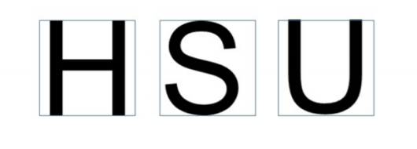

official rules can be found [here](https://junior.robocup.org/wp-content/uploads/2020Rules/final_2020rules/RescueSim-Webot-DemosimulationRules-071920.pdf).

> *would be nice to embed the pdf of the rules directly for example using: https://github.com/anvithks/hugo-embed-pdf-shortcode if that's possible*

We summarise some of the key rules below.

> *Update according to final rules*

## The Maze Based Simulation Environment
  
Robots must search a maze like world with edge and middle 'floating walls' to find as many victims as possible. Each game lasts 8 minutes.

## Swamps, Traps & Obstacles
  

* Swamp (Brown area) - leads to speed being reduced slowing process (Should be avoided!)
* Black holes – robot drops through, and is then relocated
* Obstacles – must be navigated around

## Victims

H: Harmed victim: S: Stable victim U:Unharmed victim

To identify a victim, the robot must stop for 3 seconds, and send the location and victim type to the game manager The robot must be close (1/2 tile away) from the victim

* +10/+30 points per victim depending on location
* +10 points for correct identification of type!
* -5 points for misidentification

## Lack of Progress
Robot falls through hole, or Static location for 20+ seconds. Called by team captain.

* -5 point deduction

## Areas and tiles
In area 1 the field is divided in 30 cm by 30 cm tiles. In areas 2 and 3 each tile is subdivided in four 15 cm by 15 cm squares. The connection tiles between two areas are colorcoded.
Particularities of each area:
- Area 1: walls are on the edge of each tile
- Area 2: walls can be placed on the edges of each quarter-tile with at least a full tile-width between two walls
- Area 3: walls can be placed on the edges of each quarter-tile with at least a full tile-width between two walls, 90° corners may be rounded into quarter circles

## Exit Bonus
Navigate back to the start before the end of the game for an extra 10% of your score.
